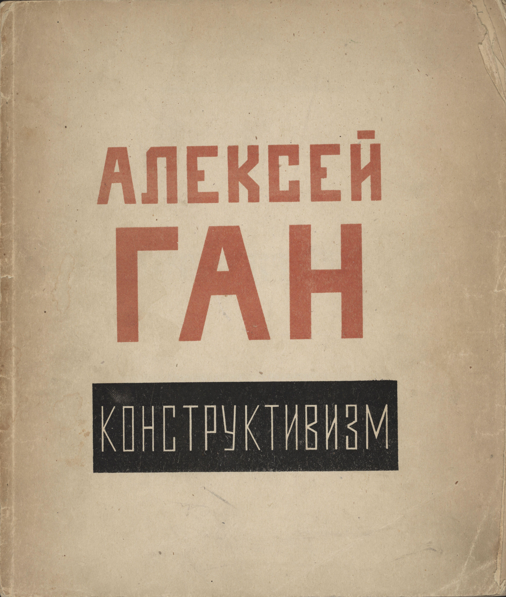
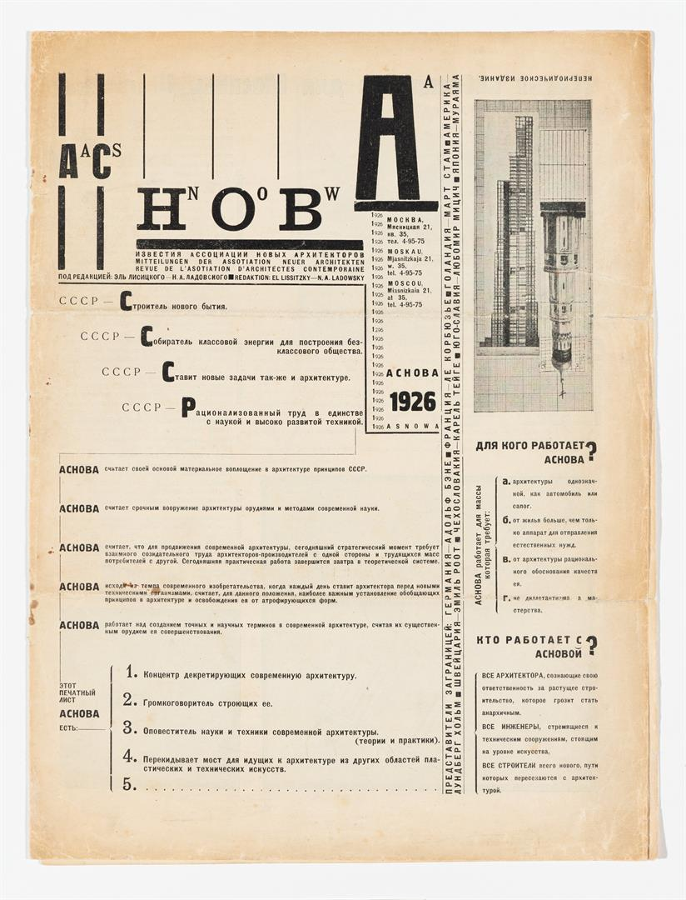
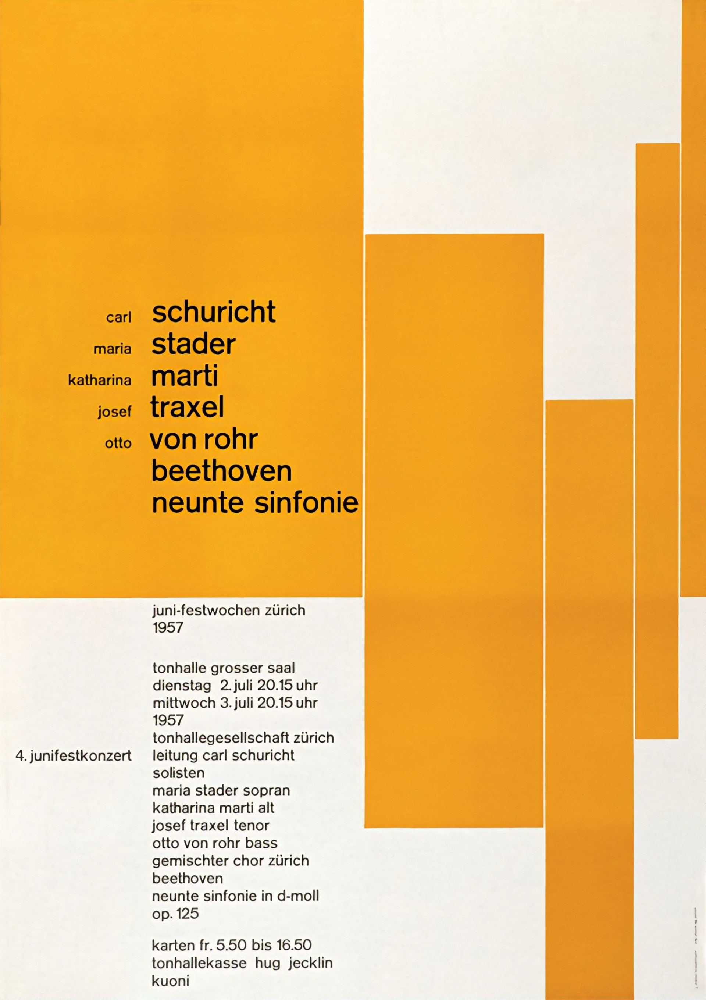
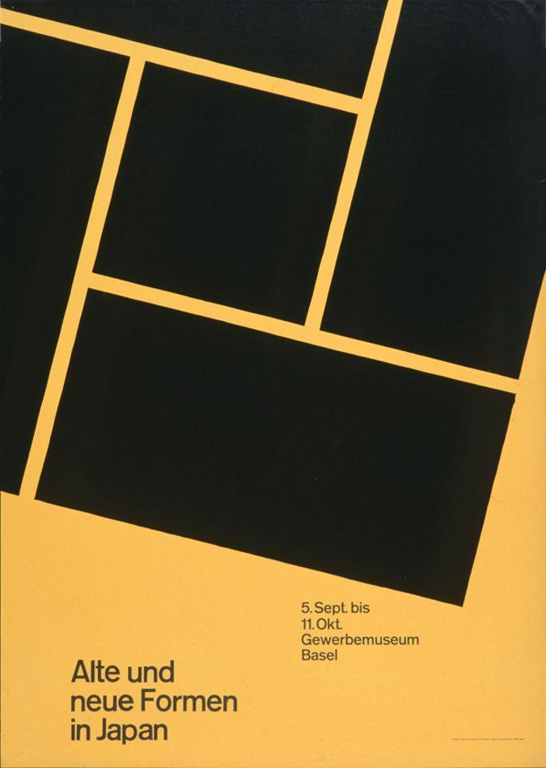
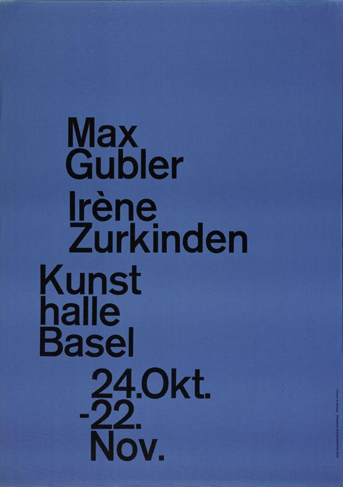

# Inspiring Designs

## Constructivism

[ [Wikipedia](https://en.wikipedia.org/wiki/Constructivism_(art)) ]

Beat the Whites with the Red Wedge, El Lissitzky, 1919.

The cover of Konstruktivizm, Aleksei Gan, 1922.

Izvestiia ASNOVA, no. 1, El Lissitzky, 1926.

**Persons**:

- [**El Lissitzky**](https://en.wikipedia.org/wiki/El_Lissitzky)

## Swiss Design

[ [Wikipedia](https://en.wikipedia.org/wiki/International_Typographic_Style) ]

Juni-Festwochen Zürich, Josef Müller-Brockmann, 1957.

Alte und neue Formen in Japan, Gewerbemuseum Basel, 1959.

Kunsthalle Basel Gubler Zurkinden, Armin Hofmann, 1959.

**Persons**:

- [**Josef Müller-Brockmann**](https://en.wikipedia.org/wiki/Josef_M%C3%BCller-Brockmann)

**Websites**:

- <https://www.swissted.com>
