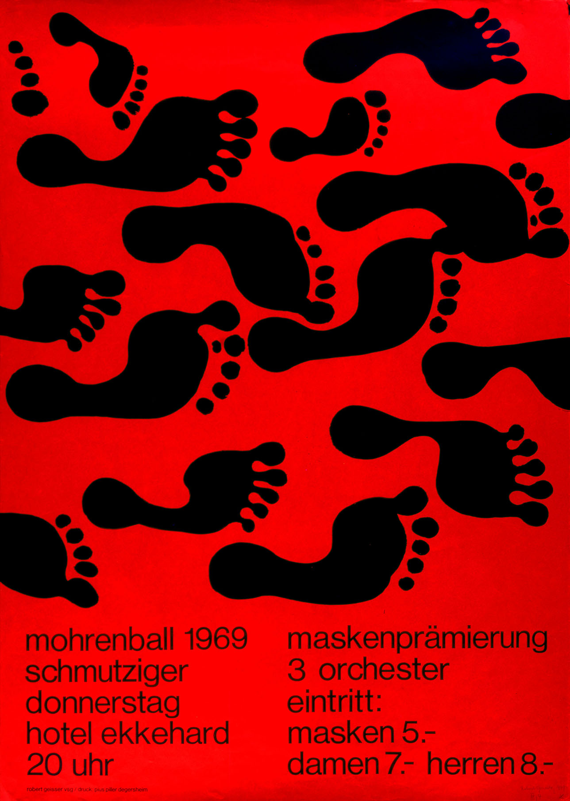
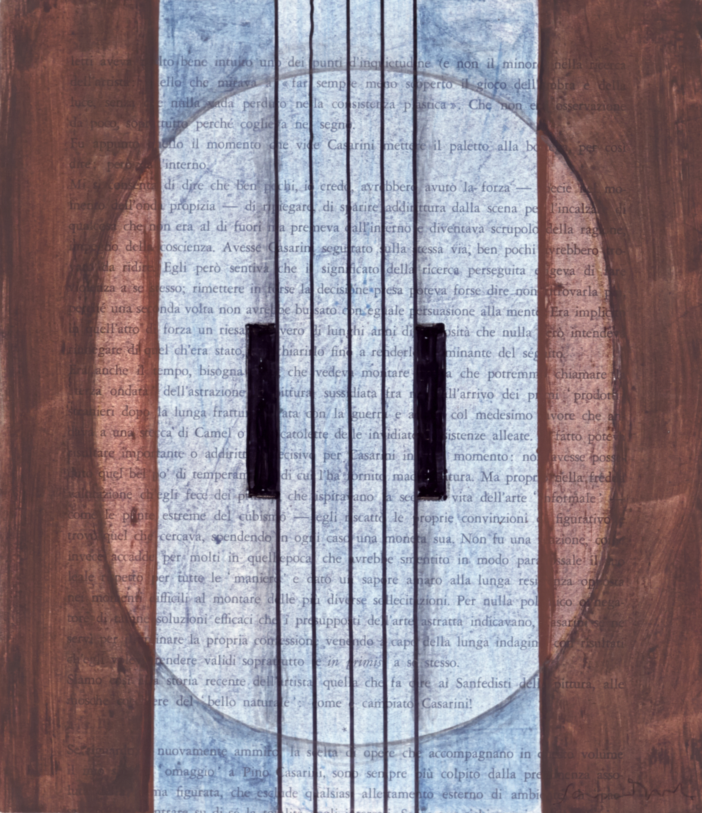
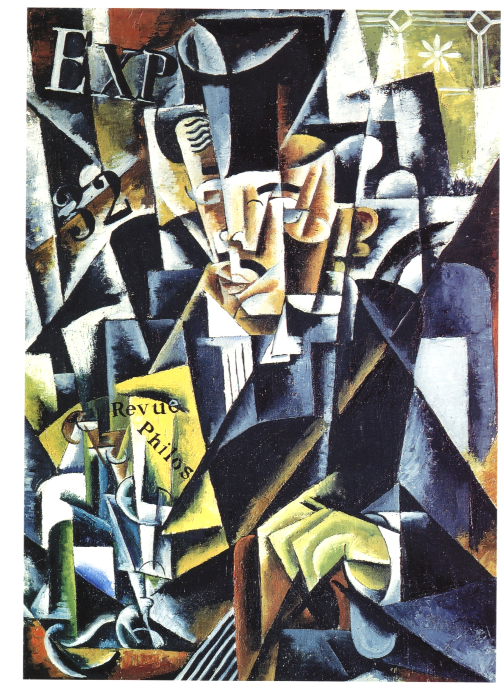
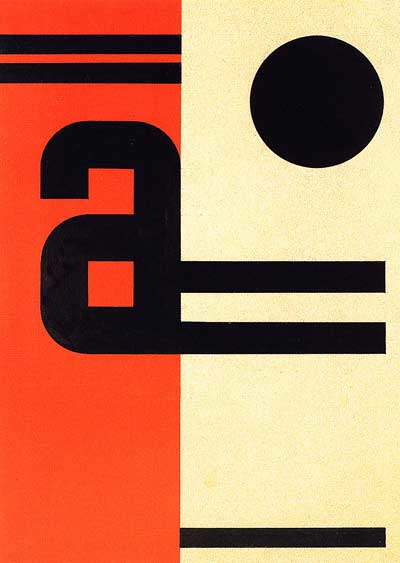
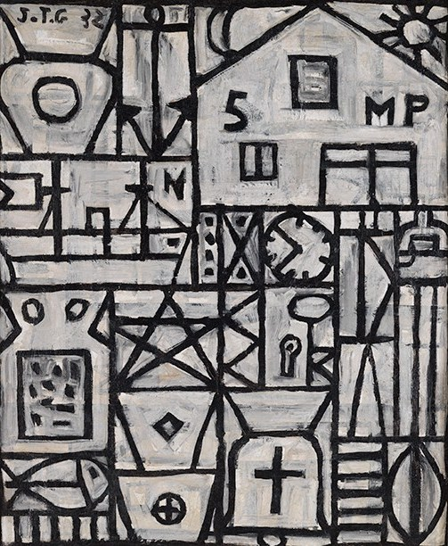

# Inspiring Designs

## Swiss Design

[ [Wikipedia](https://en.wikipedia.org/wiki/International_Typographic_Style) ]

Juni-Festwochen Zürich, Josef Müller-Brockmann, 1957.

Alte und neue Formen in Japan, Gewerbemuseum Basel, 1959.

Billboard design by Robert Geisser for event in St. Gallen, 1969

Kunsthalle Basel Gubler Zurkinden, Armin Hofmann, 1959.

## Constructivism

[ [Wikipedia](https://en.wikipedia.org/wiki/Constructivism_(art)) ]

Beat the Whites with the Red Wedge, El Lissitzky, 1919.

The cover of Konstruktivizm, Aleksei Gan, 1922.

Izvestiia ASNOVA, no. 1, El Lissitzky, 1926.

Deep Cross, Willi Sandforth, 2012.

Casarini, Willi Sandforth, 1994.

Dance. An Objectless Composition, Alexander Rodchenko, 1915.

Portrait of a Philosopher, Lyubov Popova, 1915.

Cover of "Avantgarde", Vasyl Yermylov, 1929.

"Constructive", Joaquín Torres-García, 1932.
