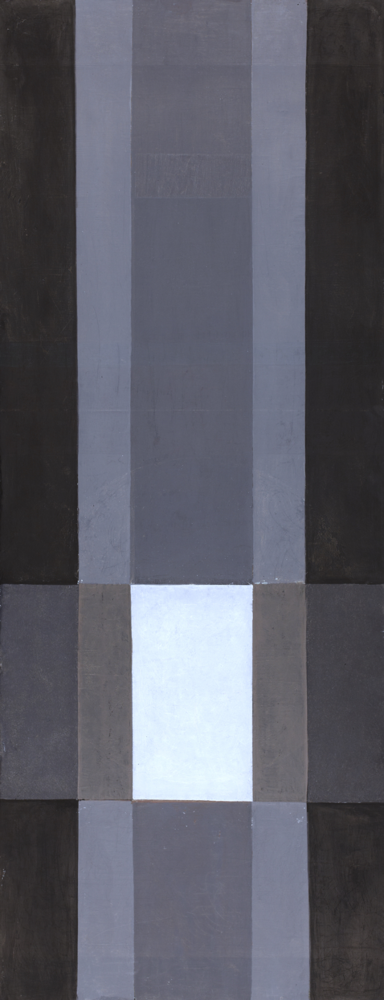

# Inspiring Designs

## Swiss Design

[ [Wikipedia](https://en.wikipedia.org/wiki/International_Typographic_Style) ]

Juni-Festwochen Zürich, Josef Müller-Brockmann, 1957.

Alte und neue Formen in Japan, Gewerbemuseum Basel, 1959.

Kunsthalle Basel Gubler Zurkinden, Armin Hofmann, 1959.

## Constructivism

[ [Wikipedia](https://en.wikipedia.org/wiki/Constructivism_(art)) ]

Beat the Whites with the Red Wedge, El Lissitzky, 1919.

The cover of Konstruktivizm, Aleksei Gan, 1922.

Izvestiia ASNOVA, no. 1, El Lissitzky, 1926.

Deep Cross, Willi Sandforth, 2012.
